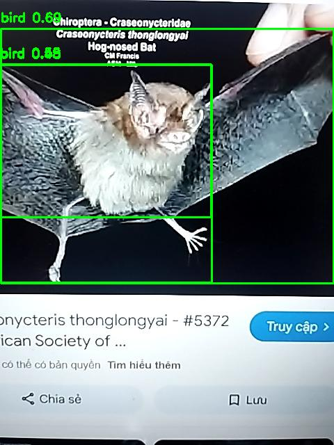

# 🍎🍌🍊 Fruit Detection using YOLOv8n

This project implements a real-time fruit detection system using the **YOLOv8n** model.  
It is trained on the `fruit-images-for-object-detection` dataset, which includes annotations for **3 classes**: `apple`, `banana`, and `orange`.
The system is designed to work with images captured via webcam and is wrapped in a user-friendly web interface built with **Flask**.

---
## Feature
-  Real-time fruit detection (apple, banana, orange)
-  Webcam support for live video stream
-  Flask-based web interface for user interaction
-  Lightweight model (YOLOv8n) suitable for deployment
---
##  Dataset

- Dataset: [fruit-images-for-object-detection](https://www.kaggle.com/datasets/mbkinaci/fruit-images-for-object-detection)
- Classes:
  - `apple`
  - `banana`
  - `orange`
- Format: Pascal VOC (converted to YOLO format)

---

##  Model

- **Architecture**: [YOLOv8n](https://github.com/ultralytics/ultralytics)
- **Framework**: [Ultralytics YOLO](https://docs.ultralytics.com/)
- **Input size**: `640x640`
- **Number of epochs**: 50
- **Batch size**: 16

---

##  Installation

```bash
# Install required libraries
pip install ultralytics opencv-python
```

---

##  Folder Structure

```
project_2_fruit_detection/
│
├── app.py                       # Flask web app for real-time detection
├── fruit_detection_yolo.ipynb  # Training and inference notebook
├── static/
│   └── result.jpg              # Output image after detection
├── templates/
│   └── index.html              # Frontend UI for image upload
├── runs/                       # YOLO training outputs
├── data/
│   └── data.yaml               # YOLO dataset configuration
```

---

##  Training & Results

```bash
yolo detect train \
    model=yolov8n.pt \
    data=./data/data.yaml \
    epochs=50 \
    imgsz=640 \
    batch=16 \
    name=fruit_yolov8n
```
Evaluation on the test set (60 images) shows:


Here is the detailed per-class evaluation result:


confusion matrix:


---


##  Run detection with webcam + Flask

Launch real-time fruit detection via a simple Flask web interface:

```bash
python app.py
```
Then open your browser and go to:

 `http://localhost:5000`

---

## Model Demo

<p align="center">
  
</p>


